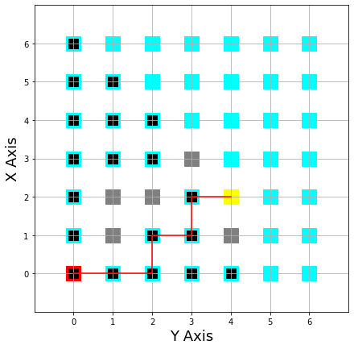

This repo contains the code for a BFS using a graph approach on a 2D matrix
simulation a robot finding its path in a maze
the starting toile in painted red and the end tile yellow
the black tiles represent explored nodes

